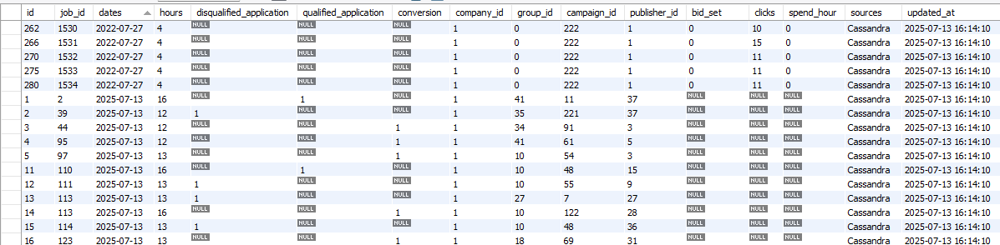
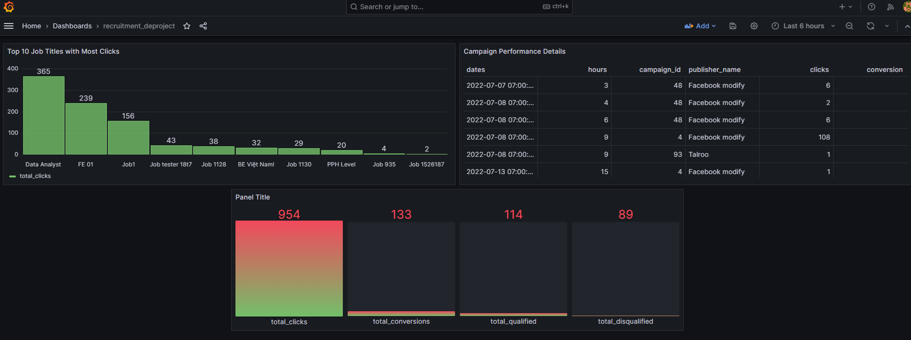

# **Recruitment Near Real-Time Data Pipeline** 🚀

A near real-time data pipeline project built for a recruitment platform. It tracks job campaign performance by calculating the number of clicks, conversions, qualified, and unqualified applications from raw logs.
---
🔍 **Objectives**
Aggregate real-time data from raw logs in Cassandra.

Processes data with **Apache Spark** (real-time or near real-time).

Enrich with job metadata from MySQL.

Store results in a structured format in MySQL Data Warehouse.

Visualize campaign performance on Grafana dashboards.
---
📊 **Architecture Overview**

[Cassandra (Raw Logs)]
        ⬇
        
[Apache Spark Job (ETL)]
        ⬇
        
[MySQL Data Warehouse]
        ⬇
        
[Grafana Dashboard]
        ⬇

---
📊**Technologies Used**
Apache Spark 3.4 for ETL

Cassandra 4.1 for storing raw tracking logs

MySQL 8.0 for storing aggregated data

Grafana 10.0 for visualization

Docker Compose for container orchestration
---
📂 **Project Structure**

├── .env

├── docker-compose.yml

├── Dockerfile

├── etl/

│   └── Python_ETL_Pipeline.py

├── jars/

│   └── spark-cassandra-connector-assembly_2.12-3.4.0.jar

├── README.md

Start Docker Services
docker-compose up --build
Add MySQL as a data source and build dashboards from the etl_data.events table.
---
🎓**ETL Job Logic**
Read new events from Cassandra (logs.tracking) using timestamp ts.

Aggregate metrics by job_id, hour, publisher_id, campaign_id, etc.

Join with MySQL dimension table (jobs) to enrich with company_id.

Insert results into etl_data.events.

Repeat every 10 seconds if new data available.
---
**Metrics Calculated**

clicks

conversions

qualified

unqualified

bid_set (avg)

spend_hour (sum of bid)

---
📈 Sample Output

---
✨ **Sample Dashboard (Grafana)**

Dashboards show KPIs like Click-Through Rate, Conversions over Time, Qualified Ratio per Campaign, Spend by Group...

🚀 Author
Ha Thuy Nguyen (Claire)

